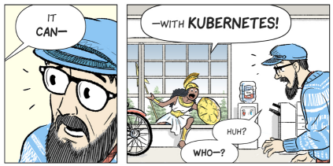

# The Midburn Kubernetes Environment

## Why can't it just work all the time?

[](https://cloud.google.com/kubernetes-engine/kubernetes-comic/)

https://cloud.google.com/kubernetes-engine/kubernetes-comic/


## Interacting with the environment

You can interact with the Kubernetes environment in the following ways - 

* GitHub - commits to master branch are continuously deployed to the relevant environment. See .travis.yaml for the continuous deployment configuration and deployed environments.
* [Google Cloud Shell](https://cloud.google.com/shell/docs/quickstart) - Easy way for quickly running management commands. Setup a Google Cloud account and enable billing (you get 300$ free, you can setup billing alerts to avoid paying too much). You can use the cloud shell file editor to edit files, just be sure to configure it to indentation of 2 spaces (not tabs - because they interfere with the yaml files).
* Any modern PC / OS should also work, you will just need to install some dependencies, mostly Docker and the gcloud SDK.
* Docker + Google Cloud service account - for automation / CI / CD. See the Docker Ops section below for more details.


## Initial installation and setup

Ensure you have permissions on the relevant Google Project. Permissions are personal, so once you authenticate with your google account, you will have all permissions granted for you by the different Google Cloud projects.

To interact with the environment locally, install [Google Cloud SDK](https://cloud.google.com/sdk/) and run `gcloud auth login` to authenticate.

On Google Cloud Shell you are already authenticated and all dependencies are installed.

Clone the repo

```
git clone https://github.com/Midburn/midburn-k8s.git
```

All following commands should run from the midburn-k8s directory

```
cd midburn-k8s
```


## Environments

The main environments should be committed to this repo under `environments` directory.

Each directory under `environments` corresponds to an environment name which you can connect to:

```
source switch_environment.sh ENVIRONMENT_NAME
```

Make sure you are connected to the correct environment before running any of the following commands.

You can create a new environment by copying an existing environment directory and modifying the values.

See the [sk8s environments documentation](https://github.com/OriHoch/sk8s/blob/master/environments/README.md#environments) for more details about environments, namespaces and clusters.


## Releases and deployments

[Helm](https://github.com/kubernetes/helm) manages everything for us.

* The preferred way to deploy is by opening and merging a pull request - this prevents infrastructure deployment risks and is generally more secure.
* If you intend to do some infrastructure development, consider creating your own personal environment and testing on that.

If you still want to deploy directly, just make sure you are the only one working on a chart on an environment and/or update with the master branch to prevent infrastructure conflicts.

Make sure you have the latest helm installed on both client and server: 

```
kubectl create -f rbac-config.yaml
helm init --service-account tiller --upgrade --force-upgrade --history-max 1
```

Deploy:

```
./helm_upgrade.sh
```

When helm upgrade command completes successfully it doesn't necesarily mean deployment is complete (although it often does) - it only updates the desired state.

Kubernetes / Helm have a desired state of the infrastructure and they will do their best to move to that state.

You can add arguments to `./helm_upgrade.sh` which are forwarded to the underlying `helm upgrade` command.

Check [the Helm documentation](https://docs.helm.sh/) for more details.

Some useful arguments:

* For initial installation you should add `--install`
* Depending on the changes you might need to add `--recreate-pods` or `--force`
* For debugging you can also use `--debug` and `--dry-run`

Additionally, you can to use `force_update.sh` to force an update on a specific deployment.

If deployment fails, you might need to forcefully reinstall tiller, you can delete the deployment and reinstall

```
kubectl delete deployment tiller-deploy --namespace kube-system
```

Also, check the kube-system configmaps, make sure there aren't too much historical releases (we limit to 2, so it shouldn't happen)

```
kubectl get configmap --namespace=kube-system
```


## Helm configuration values

The default values are at `values.yaml` - these are used in the chart template files (under `templates`, `charts`  and `charts-external` directories)

Each environment can override these values using `environments/ENVIRONMENT_NAME/values.yaml`

Finally, automation scripts write values to `environments/ENVIRONMENT_NAME/values.auto-updated.yaml` using the `update_yaml.py` script


## External Charts

Charts under `charts-external` directory are deployed in a dedicated helm release for each chart.

To deploy external charts, you should use the `./helm_upgrade_external_chart.sh` script:

```
./helm_upgrade_external_chart.sh <EXTERNAL_CHART_NAME> [HELM_UPGRADE_ARGUMENTS]..
```

This script does the following:

* creates a values files containing only the values under root attributes `global` and under the chart name.
* deploys a helm release named `(MAIN_RELEASE_NAME)-(CHART_NAME)-(ENVIRONMENT_NAME)` from the helm chart under `charts-external/CHART_NAME`


## Secrets

Secrets are stored and managed directly in kubernetes and are not managed via Helm.

To update an existing secret, delete it first `kubectl delete secret SECRET_NAME`

After updating a secret you should update the affected deployments, you can use `./force_update.sh` to do that

All secrets are optional so you can run the environment without any secretes and will use default values similar to dev environments.

Each environment may include a script to create the environment secrets under `environments/ENVIRONMENT_NAME/secrets.sh` - this file is not committed to Git.

You can use the following snippet in the secrets.sh script to check if secret exists before creating it:

```
! kubectl describe secret <SECRET_NAME> &&\
  kubectl create secret generic <SECRET_NAME> <CREATE_SECRET_PARAMS>
```


## Docker OPS

To faciliate CI/CD and other automated flows we use the [sk8s-ops](https://github.com/orihoch/sk8s-ops#sk8s-ops) docker container.

To run the docker ops container locally, you should get a Google Service Account key with relevant permissions.

Download the docker ops script

```
wget https://raw.githubusercontent.com/OriHoch/sk8s/master/run_docker_ops.sh && chmod +x run_docker_ops.sh
```

Get list of pods (assuming you have the required secret key under `secret-k8s.ops.json`)

```
./run_docker_ops.sh ENVIRONMENT_NAME "kubectl get pods" "orihoch/sk8sops" Midburn/midburn-k8s master secret-k8s-ops.json
```

See the [SK8S ops documentation](https://github.com/orihoch/sk8s-ops#sk8s-ops) for more details


## Patching configuration values without Helm

This method works in the following conditions:

* You want to make changes to a main / shared environment (`production` / `staging`) - otherwise, just do a helm upgrade.
* You want to modify a specific value in a specific resource (usually a deployment)
* This value is represented in the Helm configuration values

Update the auto-updated yaml value/s

```
./helm_update_values.sh '{"spark":{"image":"orihoch/spark:testing123"}}'
```

Commit and push to GitHub master branch. It's important to commit the changes to Git **first** and only then patch the deployment - this prevents infrastrcuture conflicts.

Patch the deployment and wait for successful rollout

```
kubectl set image deployment/spark spark=orihoch/spark:testing123
kubectl rollout status deployment spark
```


## Patching configuration values from CI / automation scripts

Create a [GitHub machine user](https://developer.github.com/v3/guides/managing-deploy-keys/#machine-users).

Give this user write permissions to the k8s repo.

Set the following environment variables in the CI environment:

* `K8S_OPS_GITHUB_REPO_TOKEN` - the machine user's token
* `DEPLOYMENT_BOT_EMAIL` - you can make up any email, it will show up in the commit
* `DEPLOYMENT_BOT_NAME` - same as the email, can be any name

Run the `helm_update_values.sh` script from an authenticated OPS container connected to the relevant environment

```
./helm_update_values.sh '{"spark":{"image":"orihoch/spark:testing123"}}' "${K8S_ENVIRONMANE_NAME} environment - spark image update --no-deploy"
```

Add the `--no-deploy` argument to the commit message to prevent automatic deployment if you want to deploy manually

To patch the resource manually, you could run something like this afterwards:

```
kubectl set image deployment/spark spark=orihoch/spark:testing123
kubectl rollout status deployment spark
```


## Continuous Deployment

Each app / module is self-deploying using the above method for patching configurations

The continuous deployment flow is based on:

* Travis - runs the deployment script on each app's repo on commit to master branch (AKA merge of PR).
* Ops Docker (see above) - provides a consistent deployment environment and to securely authenticate with the service account secret.
* GitHub - for persistency of deployment environment values - GitHub maintains the state of the environment. Each app commits deployment updates to the k8s repo.

We use [Travis CLI](https://github.com/travis-ci/travis.rb#installation) below but you can also do the setup from the UI.

Enable Travis for the repo (run `travis enable` from the repo directory)

Copy `.travis.yml` from this repo to the app repo and modify the values / script according to your app requirements

Set the k8s ops service account secret on the app's travis

This command should run from the root of the external app, assuming the midburn-k8s repo is a sibling directory:

```
travis encrypt-file ../midburn-k8s/secret-midburn-k8s-ops.json secret-midburn-k8s-ops.json.enc
```

Copy the `openssl` command output by the above command and modify in the .travis-yml

The -out param should be `-out k8s-ops-secret.json`

Create a GitHub machine user according to [these instructions](https://developer.github.com/v3/guides/managing-deploy-keys/#machine-users).

Give this user write permissions to the k8s repo.

Add the GitHub machine user secret key to travis on the app's repo:

```
travis env set --private K8S_OPS_GITHUB_REPO_TOKEN "*****"
```

Commit the .travis.yml changes and the encrypted file.


## Exposing services

Main entrypoint is a [traefik](https://traefik.io/) service, exposed via a load balancer.

Traefik provides application load balancing with path/host-based rules. HTTPS is provided seamlessly using Let's encrypt.

In addition to traefik, the nginx pod can optionally be used on specific service for more advanced use-cases such as auth or caching.


## Static IP for the load balancer

Reserve a static IP:

```
gcloud compute addresses create midburn-ENVIRONMENT_NAME-traefik --region=us-central1
```

Get the static IP address:

```
gcloud compute addresses describe midburn-ENVIRONMENT_NAME-traefik --region=us-central1 | grep ^address:
```

Update in `values.ENVIRONMENT_NAME.yaml`:

```
traefik:
  loadBalancerIP: <THE_STATIC_IP>
```


## Http authentication

HTTP authentication is provided using nginx.

You should configure a traefik backend that points to the nginx pod on a specific port number, then update `nginx-conf.yaml` to handle that port number with http auth enabled.

To add a user to the htpasswd file:

```
htpasswd ./secret-nginx-htpasswd superadmin
```

(use `-c` if you are just creating the file)

set the file as a secret on k8s:

```
kubectl create secret generic nginx-htpasswd --from-file=./secret-nginx-htpasswd
```

Update the value in `values.ENVIRONMENT_NAME.yaml`:

```
nginx:
  htpasswdSecretName: nginx-htpasswd
```


## Authorize with GitHub to push changes

Having infrastructure as code means you should be able to push any changes to infrastructure configuration back to GitHub.

You can use the following procudure on both Google Cloud Shell and from local PC

Create an SSH key -

```
[ ! -f .ssh/id_rsa.pub ] && ssh-keygen -t rsa -b 4096 -C "${USER}@cloudshell"
cat ~/.ssh/id_rsa.pub
```

Add the key in github - https://github.com/settings/keys

Clone the repo

```
git clone git@github.com:midburn/midburn-k8s.git
```


## Delete an environment and related resources

```
helm delete midburn --purge
```


## Shared / Persistent Storage

Shared / Persistent storage is available by a dedicated storage instance which pods can connect to using NFS.

Following method can be used to migrate existing data or to create a new persistent storage volume

SSH to the storage node

```
gcloud compute ssh midburn-k8s-persistent-storage-vm
```

Following should run as your personal user account under the storage node:

```
mkdir -p /data/<ENVIRONMENT_NAME>/<STORAGE_NAME>
```

At this point you can optionally migrate data from an existing pod (you will need to connect to the environment from the storage node)

```
gcloud auth login
git clone https://github.com/Midburn/midburn-k8s.git ~/midburn-k8s
cd ~/midburn-k8s
source switch_environment.sh <ENVIRONMENT_NAME>
kubectl cp <POD_NAME>:/path/to/data /data/<ENVIRONMENT_NAME>/<STORAGE_NAME>
```

Make sure data directory has correct permissions

```
sudo chown -R root:root /data/<ENVIRONMENT_NAME>/<STORAGE_NAME>
```

Use the volume in a pod

```
      {{ if .Values.global.persistentStorageIP }}
        volumeMounts:
        - name: <STORAGE_NAME>
          mountPath: /path/to/data
      volumes:
      - name: <STORAGE_NAME>
        nfs:
          path: "/data/{{ .Values.global.environmentName }}/<STORAGE_NAME>"
          server: {{ .Values.global.persistentStorageIP | quote }}
      {{ end }}
```
